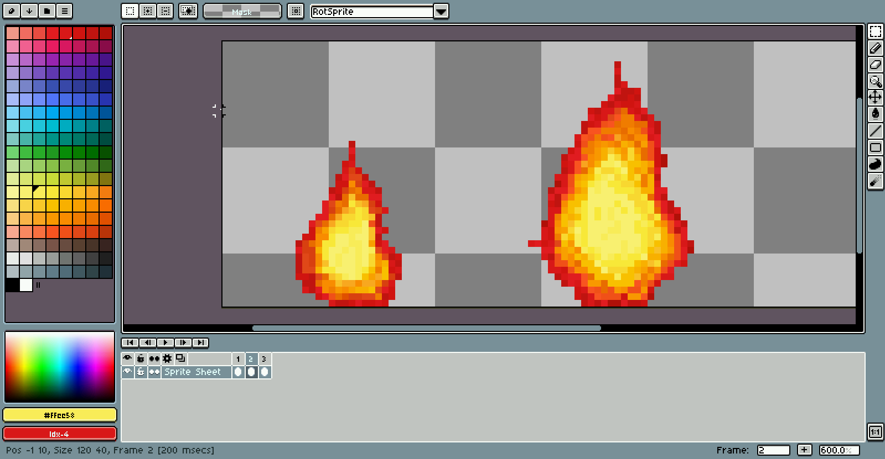
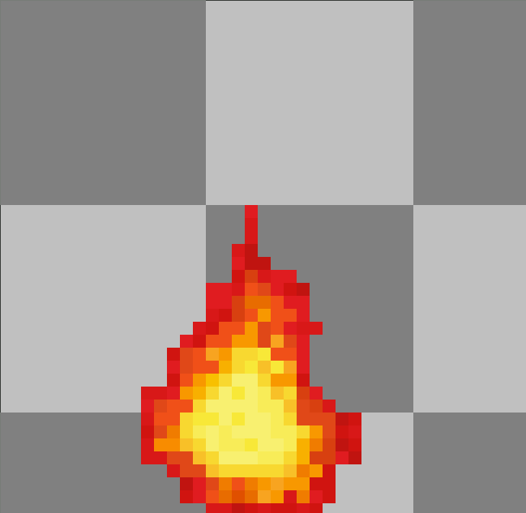
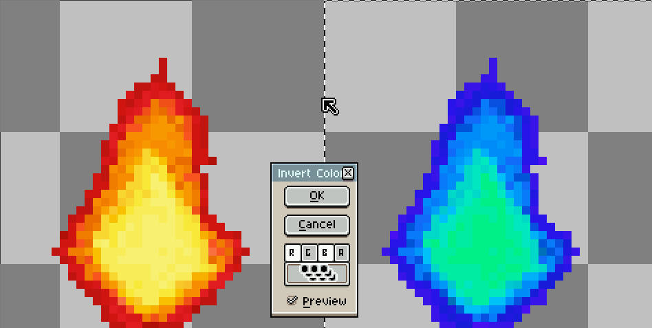

Moving Fire on the Go! - ABRACADABRA
====================================

Pixel Art
---------
![fire][fire] 

Some time after I created that unpleasant fire, I make up my mind to create a
better fire (pixel art) that move (partly inspired by the dancing banana). I
plan to use [aseprite](//aseprite.org).

[fire]: /pub/fire.png

### Drawing
Draw two image (32x32px each, skip to the **Fixing** to read more about what I
did wrongly) side-by-side to set an alternative image.

### Animate
Use `tab` to open the timeline and press `Alt + n` to create a new frame. Try
to rotate some part and modify it to make it looks like it is moving.



### Enlarge
    convert input.gif -scale 125% output.gif

##### **Note: as a side effect, the fire seems to shake. Nice one [@Max-P](//max-p.me)**

#### Fixing
Later on, I figured out not to manually enlarge it but to enlarge the canvas
size by 8px (40px now) and redraw everything.



### Inverts
After drawing it, I plan to create another image that have blue flame instead
of red flame by extending the canvas size by another 40px horizontally.

1. Use `Rectangular Marquee Tool` or press `m` and select the red flame.
2. `Ctrl + click` and paste the image next to it.
3. In `Edit -> Invert`, ignore green component and apply to all cell in the
   sprite.



### Outputs
![afire][afire]

[afire]: /pub/fire.gif

### Integrate
Add `<a id=fire href="/" >` to `index.html`. Modify `style.css`:
```
#fire {
	display: inline-block;
	width: 40px; height: 40px;
	background: url(/img/fire.gif);
}
#fire:hover     {background-position:-40px 0;}
#fire:active	{background-position:-80px 0;}
```
This will move the background to another position when it is during hover or
active.

Traditional + Modern Art
------------------------
Inspired by [pepper&carrot's art](//peppercarrot.com)

**Coming soon...**
